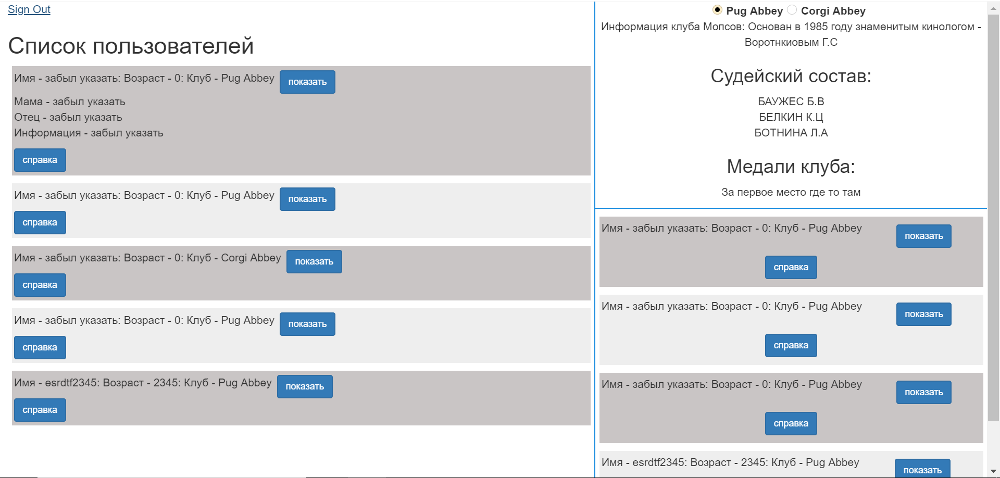

cd MongoDBFirstTry  =>
npm install  =>
установить mongo файлы mongodb =>
запустить mongod.exe => 
cd MongoDBFirstTry =>
node app

для более удобной работы с Mongodb , рекомендуется установить [MongoDB Compass](https://www.mongodb.com/products/compass)

При первом запуске приложения , в файле app.js будет создана база данных dogExhibitiondb с тремя коллекциями :
users, clubs, admins.  
clubs - содержит информацию о клубах ( общие сведения клуба - info, судьи - experts, медали - medals, участники - numbers)  
users - содержит информацию об участниках клубов ( имя, возраст, клуб )  
admins - содержит коллекцию админов с ограниченными правами вносить правки в бд ( вноcить/удалять учатников, изменять их данные, изменять поля  medals, experts у clubs )  
  
По умолчанию будут созданы два клуба Pug Abbey и Corgi Abbey с уже заполненными полями info, medals, experts, 
и профиль админа бд - с логином admin и паролем pass.

